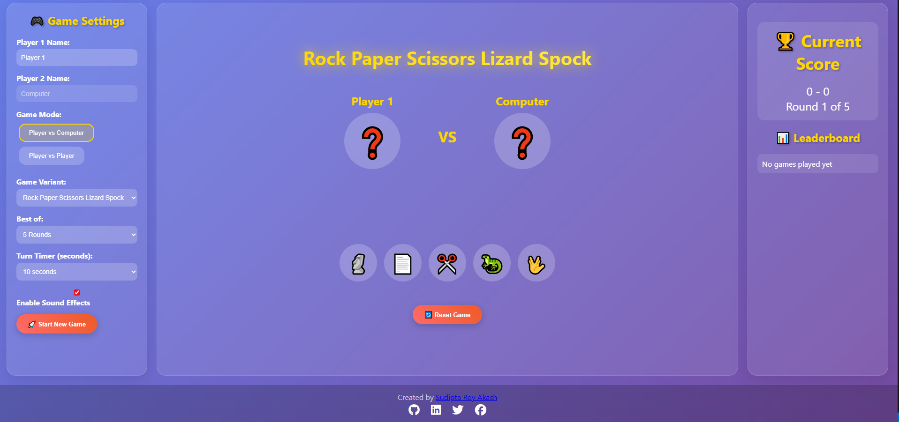

# 🚀 Rock, Paper, Scissors, Lizard, Spock - The Ultimate Showdown


A feature-rich, browser-based implementation of the classic game, extended with "Lizard" and "Spock". This game is built with vanilla JavaScript, HTML, and CSS, featuring multiple game modes, a challenging adaptive AI, and a clean, modern interface.

---

## ✨ Live Demo

Check out the live version of the game here: **[Live Demo Link](https://devsudipta.github.io/your-repo-name/)** *(Replace with your actual GitHub Pages link)*

---

## 📸 Screenshots

Here you can see the game in action.

   
---

## 🎮 Features

* **Multiple Game Variants:** Play the classic 3-choice **Rock, Paper, Scissors** or the extended 5-choice **Rock, Paper, Scissors, Lizard, Spock**.
* **Multiple Game Modes:**
    * **Player vs. Computer (PvC):** Challenge a smart, adaptive AI that learns from your moves.
    * **Player vs. Player (PvP):** Play against a friend on the same device.
* **Adaptive AI:** The computer opponent analyzes your move history to predict your next choice and counter it.
* **Game Customization:** Set the number of rounds ("Best of 3, 5, or 7") to determine the winner.
* **Turn Timers:** Add pressure by setting a timer for each player's turn.
* **Local Leaderboard:** Your victories are saved to the browser's local storage to track high scores.
* **Sound Effects:** Engaging, dynamically generated sound effects for game actions (no audio files needed!).
* **Responsive Design:** Looks and plays great on both desktop and mobile devices.

---

## 🛠️ Technologies Used

* **HTML5:** For the core structure and content.
* **CSS3:** For styling, animations, and the responsive grid layout.
* **Vanilla JavaScript (ES6+):** For all game logic, DOM manipulation, and dynamic features.

---

## 🕹️ How to Play

1.  **Configure Settings:**
    * Enter player names.
    * Choose a game mode (PvC or PvP).
    * Select a game variant (Classic or Extended).
    * Set the number of rounds and the turn timer.
2.  **Start the Game:** Click the "Start New Game" button.
3.  **Make Your Choice:** Click on one of the choice buttons (🗿, 📄, ✂️, 🦎, 🖖) at the bottom of the game arena.
4.  **Next Round:** After a round ends, click "Next Round" to continue.
5.  The first player to win the majority of the rounds wins the game!

---

## ⚙️ How to Run Locally

To run this project on your local machine, follow these simple steps:

1.  Clone the repository:
    ```sh
    git clone [https://github.com/devsudipta/your-repo-name.git](https://github.com/devsudipta/your-repo-name.git)
    ```
2.  Navigate to the project directory:
    ```sh
    cd your-repo-name
    ```
3.  Open the `index.html` file in your favorite web browser.

And you're all set to play!

---

## 👤 Author

This project was created by **Sudipta Roy Akash**.

<p>
    <a href="https://www.sudiptaroy.info/" target="_blank">🌐 Portfolio</a> •
    <a href="https://github.com/devsudipta" target="_blank">🐱 GitHub</a> •
    <a href="https://linkedin.com/in/your-linkedin-username" target="_blank">🔗 LinkedIn</a>
</p>

---

## 📄 License

This project is licensed under the MIT License. See the `LICENSE` file for details.